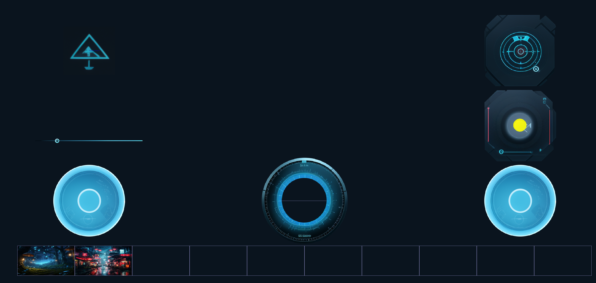

# rust-sdl-ui
UI widgets written for SDL. Mainly for drone remote control.

## Quick Start

```bash
sudo apt install  libsdl2-gfx-dev libsdl2-image-dev libsdl2-dev
cargo build --examples
target/debug/examples/widget-demo
```

Example of UI written with the help of this library:



